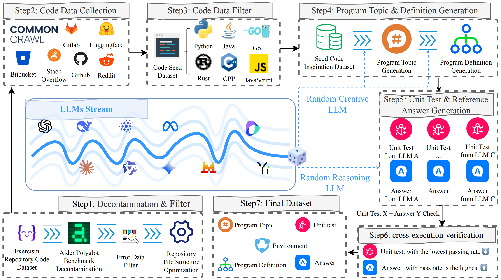
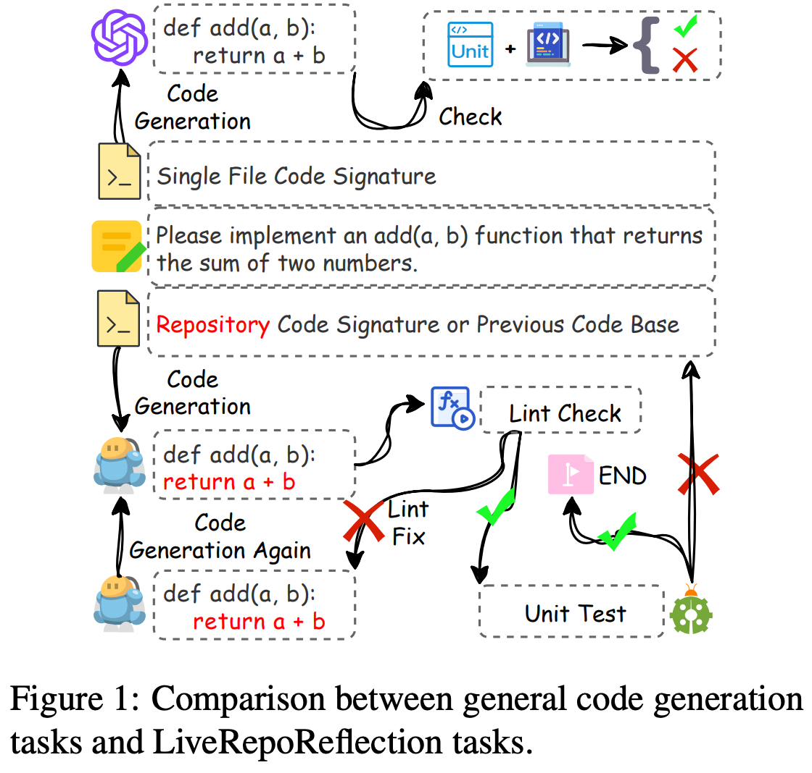
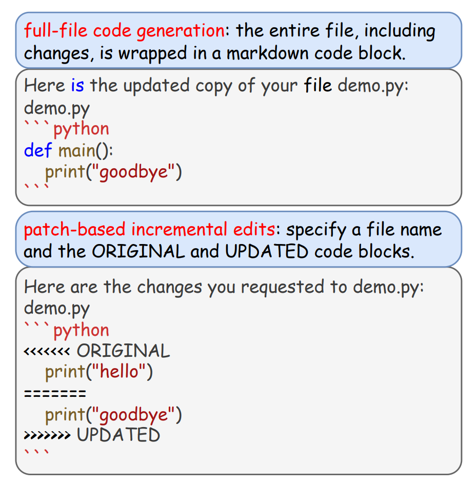

# LiveRepoReflection: A Benchmark and Pipeline for Repository-based Code Reflection

[](LICENSE)

<p align="left">
    <a href="https://github.com/LiveRepoReflection/LiveRepoReflection-Project">🐳 Evaluation Environment / Benchmark / Pipeline (<-- You are here) </a> 
</p>
<p align="left">
    <a href="https://github.com/LiveRepoReflection/LiveRepoReflection">📊 Benchmark Data </a>
</p>
<p align="left">
    <a href=".">📚 Instruct Data (Coming Soon) </a>
</p>
<p align="left">
    <a href=".">🤗 RepoReflectionCoder (Coming Soon) </a>
</p>

Welcome to the official repository for **LiveRepoReflection**. This project, detailed in our paper "*Turning the Tide: Repository-based Code Reflection*", addresses a critical gap in the evaluation of Code Large Language Models (LLMs): their ability to understand, modify, and reflect upon code within the context of a multi-file repository.

While traditional benchmarks focus on generating standalone functions, `LiveRepoReflection` evaluates LLMs on more realistic software development tasks that require navigating and editing complex, interdependent codebases.

## Core Components

This repository provides a suite of tools and datasets for advancing research in code intelligence:

1.  **`LiveRepoReflection` Benchmark**: A challenging benchmark featuring **1,888 rigorously filtered test cases** across 6 programming languages (Python, Java, Go, Rust, C++, JavaScript). It is designed to be high-difficulty, diverse, and resistant to data contamination by using a dynamic generation pipeline and expert human annotation.

2.  **`RepoReflection-Instruct` Dataset**: A large-scale (from an initial pool of 500k examples), quality-filtered instruction-tuning dataset. This dataset is the result of a sophisticated multi-turn dialogue simulation, designed to train models on complex, iterative coding tasks.

3.  **`RepoReflectionCoder` Model**: A code-specialized LLM fine-tuned from `Qwen2.5-Coder-32B` using the `RepoReflection-Instruct` dataset. It is optimized for repository-level understanding and generation.

4.  **Automated Data Pipeline**: The full pipeline used to generate both the benchmark and the instruction dataset, ensuring a continuous supply of fresh, high-quality data.

## The Automated and Dynamic Data Pipeline

Our framework is built on an automated pipeline that ensures the continuous generation of high-quality, relevant, and challenging coding problems. This process, illustrated in our paper, prevents benchmark overfitting and data contamination.

<center>
    
    <br>
    <div style="color:orange; border-bottom: 1px solid #d9d9d9;
    display: inline-block;
    color: #999;
    padding: 2px;"></div>
</center>

**The key stages are:**

1.  **Seed Data Collection**: We gather code from diverse public sources (GitHub, Hugging Face, etc.) across six key languages.
2.  **Multi-Turn Dialogue Generation**: A stream of different LLMs are used to generate new problem definitions, unit tests, and reference solutions in a conversational, multi-step process to ensure consistency and creativity.
3.  **Cross-Execution Verification**: All generated test-solution pairs are executed in a sandboxed environment. We retain only the most challenging and correct pairs, filtering out trivial or faulty examples.
4.  **Difficulty-based Filtering & Human Annotation**: We use strong LLMs to further filter for difficulty. Problems that are too easy are discarded. The final set of 1,888 test cases is manually verified by human experts to ensure quality, correctness, and rationality.

## Getting Started

### 1. Environment Setup

We recommend using Conda to manage the environment.

```bash
# Create and activate the conda environment
conda create -n LiveRepoReflection python=3.12 -y
conda activate LiveRepoReflection
```

### 2. Installation

For benchmark, install nothing and just run shell script.

For pipelines, install the necessary dependencies based on the component you wish to use.

```
pip install -r pipelines/requirement.txt
```


### 3. Configuration

Our pipelines and evaluation scripts require API keys for interacting with LLMs. Please configure these as environment variables.

For example, you can create a `.env` file in the project root:

```
OPENAI_API_KEY="sk-your_openai_api_key"
OPENAI_API_BASE="https://api.openai.com/v1/"
# Add other provider keys as needed (e.g., ANTHROPIC_API_KEY)
```

Or export them directly in your shell:

```bash
export OPENAI_API_KEY="sk-your_openai_api_key"
```

## How to Use

### Running the Benchmarks

The entry points for running the benchmarks are located in the `evaluation/run/` directory. The evaluation framework is designed to be robust and reproducible, using a `test.sh` script to create an isolated environment for each run. This script handles the setup of all necessary language runtimes (Python, Go, Rust, Node.js) and dependencies.

The `run_test.sh` scripts are the primary interface for launching a benchmark. They configure and then execute `test.sh`.

#### Evaluation Modes

The benchmark runs in two parallel modes for each model, providing a comprehensive evaluation:

-   **`whole` mode**: The model is given the full content of files and must return the complete, modified content.
-   **`diff` mode**: The model is expected to generate a patch in the style of `diff`, which is more efficient for large files and complex changes.

The results from both modes are automatically collected and summarized.

#### Running the `LiveRepoReflection` Benchmark

<div>
  
  
</div>

1.  **Configure the evaluation**: Open `evaluation/run/LiveRepoReflection/run_test.sh` and customize the following key parameters:

    -   `MODEL_NAME`: A descriptive name for the model being tested (e.g., "MyCoder-v1"). This is used for creating the output directory.
    -   `CUSTOM_OPENAI_API_BASE`: The base URL for the model's API endpoint (e.g., `http://127.0.0.1:8000/v1/`).
    -   `CUSTOM_OPENAI_API_KEY`: The API key for the model endpoint.
    -   `OUTPUT_DIR`: The base directory where evaluation results will be stored. A subdirectory will be created here for each run.
    -   `THREADS_NUM`: The number of parallel threads to use for the evaluation.
    -   `PROXY_MODE`: (Optional) Set to `stream` or `non_stream` to route requests through the built-in proxy server for logging and debugging. Default is `off`.
    -   `HACK_PROXY`: (Optional) Set to `on` to use the proxy to modify data on-the-fly. Default is `off`.
    -   `AIDER_PARAMS`: (Optional) A JSON string to pass extra parameters to the underlying Aider evaluation tool, such as `max_tokens`.

2.  **Execute the benchmark**:
    ```bash
    bash evaluation/run/LiveRepoReflection/run_test.sh
    ```

#### Running the `Aider Polyglot Benchmark`

The process is identical. Configure the corresponding `run_test.sh` script and execute it.

1.  **Configure the evaluation**: Open `evaluation/run/aider-polyglot-benchmark/run_test.sh` and set the parameters as described above.

2.  **Execute the benchmark**:
    ```bash
    bash evaluation/run/aider-polyglot-benchmark/run_test.sh
    ```

#### Understanding the Results

After a run completes, a `results.json` file will be created in your specified output directory. This file contains the final, aggregated results, including `pass@1`, `pass@2`, `well_format`, and `fix_weight` metrics for both `whole` and `diff` evaluation modes.


### Running the Data Generation Pipeline

The data generation pipeline consists of five main stages. The scripts in the `pipelines/` directory allow you to execute this process to generate your own data.

**Stage 1: Spider - Collect Seed Data**

This stage involves running spider scripts to collect seed data from sources like GitHub and Exercism.

```bash
python pipelines/spider/github_exercim.py --output_path ./pipelines/generate/dataset/seed_data.jsonl
```

**Stage 2: Extract and Preprocess**

After collecting the seed data, you need to extract and preprocess it to create a unified format.

```bash
python pipelines/generate/extract_and_preprocess.py \
  --input_path ./pipelines/generate/dataset/seed_data.jsonl \
  --output_path ./pipelines/generate/dataset/all/all.jsonl
```

**Stage 3: Generate Questions and Project Names**

This script takes the preprocessed data and uses LLMs to generate new, challenging programming questions and corresponding project names.

```bash
python pipelines/generate/generate_question_and_name.py \
  --input_path ./pipelines/generate/dataset/all/all.jsonl \
  --output_path ./pipelines/generate/dataset/question_and_name/ \
  --workers 10
```

**Stage 4: Generate Answers and Unit Tests**

This script uses the generated questions to produce complete solutions and their corresponding unit tests.

```bash
python pipelines/generate/generate_answer_unit_test.py \
  --input_path ./pipelines/generate/dataset/question_and_name/YOUR_RUN_ID/all.jsonl \
  --output_path ./pipelines/generate/dataset/answer_unit_test/
```

**Stage 5: Check and Verify (Parallel Execution)**

After generating the data, this final stage runs the unit tests to verify the correctness of the generated solutions. This process is designed for large-scale parallel execution.

**5a: Split Data for Parallelism**

First, split the large generated dataset into smaller, manageable chunks for parallel processing.

```bash
# Define paths for clarity
INPUT_FILE="pipelines/generate/dataset/answer_unit_test/YOUR_RUN_ID/all.jsonl"SPLIT_FILE="pipelines/check/dataset/run_unit_test/YOUR_RUN_ID/splits.json"python pipelines/check/split_indices.py \  --input_path ${INPUT_FILE} \  --output_file ${SPLIT_FILE} \  --average_lines 100 # Adjust based on desired chunk size
```

**5b: Run Unit Tests in Parallel**

Next, run the unit tests on each split. This step is typically executed on a cluster using a job scheduler (e.g., SLURM) or a simple shell loop. Each job will process one split defined in `splits.json`.

```bash
# This is a conceptual command for a single job
python pipelines/check/run_unit_test_index.py \  --input_path ${INPUT_FILE} \  --output_path ./pipelines/check/dataset/run_unit_test/YOUR_RUN_ID/split_1/ \  --split_id 1 \  --splits_json_path ${SPLIT_FILE}
```

**5c: Merge Parallel Results**

Once all parallel jobs are complete, merge their individual output files into a single result file.

```bash
python pipelines/check/merge_results_thread.py \  --batch_dir ./pipelines/check/dataset/run_unit_test/YOUR_RUN_ID/
```

**5d: Parse and Finalize Results**

Finally, parse the merged raw test output to extract structured data (pass/fail counts, errors, etc.) and create the final, clean dataset.
```bash
python pipelines/check/parser.py \  --input_path ./pipelines/check/dataset/run_unit_test/YOUR_RUN_ID/merged_all.jsonl \  --output_path ./pipelines/check/dataset/final_parsed_results/
```


## How to Cite

If you use `LiveRepoReflection` in your research, please cite our paper:

```bibtex
@misc{zhang2025LiveRepoReflection,
      title={Turning the Tide: Repository-based Code Reflection}, 
      author={Wei Zhang and Jian Yang and Jiaxi Yang and Ya Wang and Zhoujun Li and Zeyu Cui and Binyuan Hui and Junyang Lin},
      year={2025},
      eprint={2507.09866},
      archivePrefix={arXiv},
      primaryClass={cs.SE},
      url={https://arxiv.org/abs/2507.09866}, 
}
```

## License

This project is licensed under the **Apache 2.0 License**. See the [LICENSE](LICENSE) file for details.
